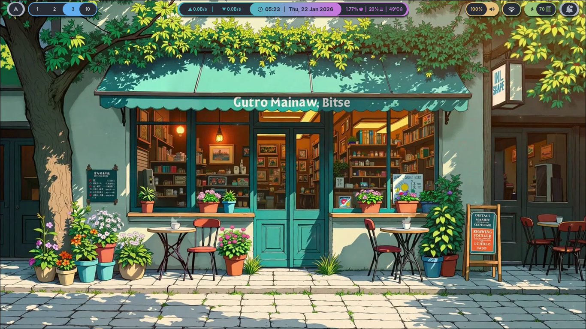
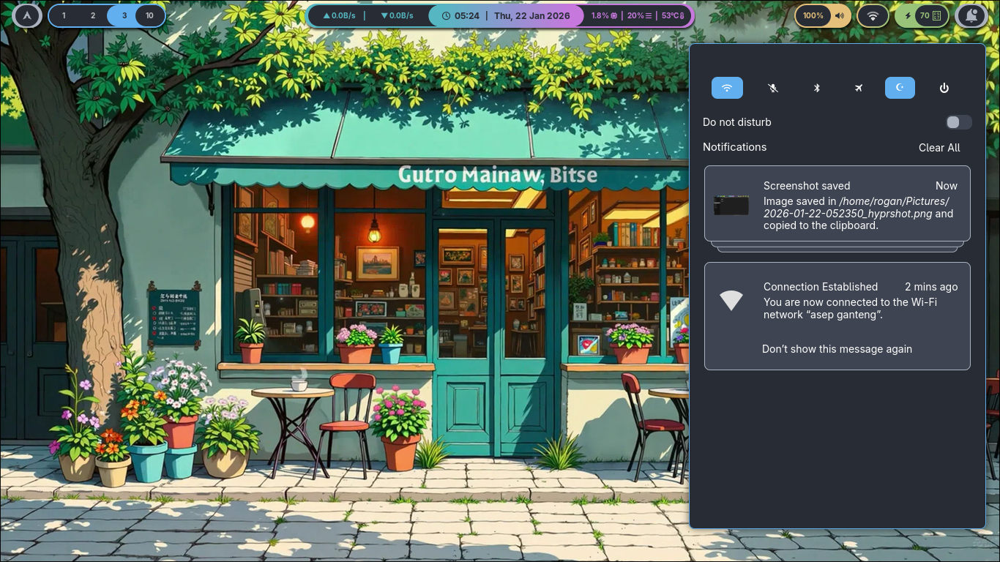
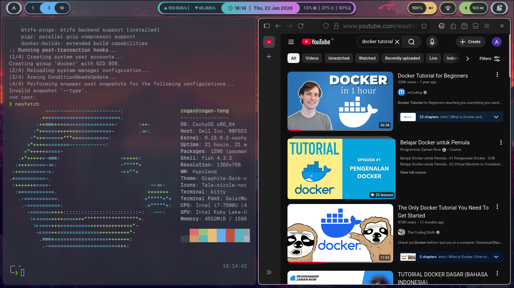
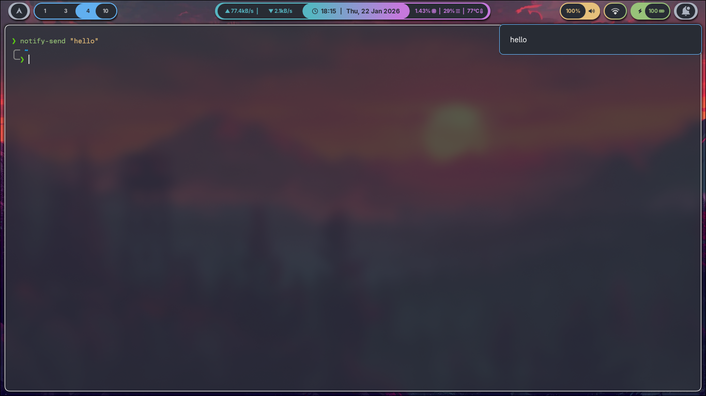
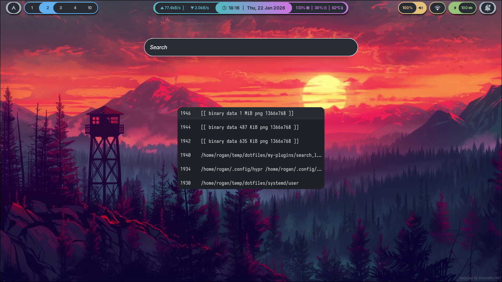
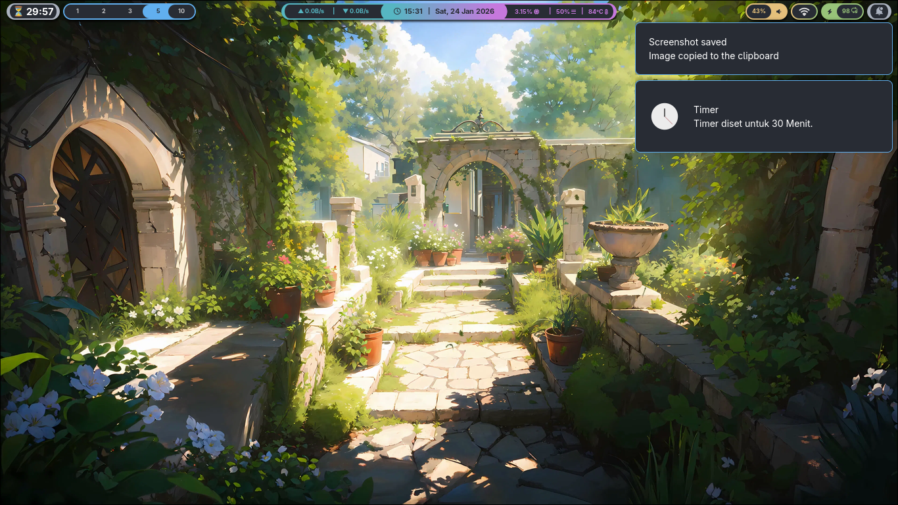

## About
All of this is what will i install to my wayland if only i had just installed it.

## Dotfiles
dotfiles setup for my persoanl hyprland environment.
equipped with features needed for productivity.

## Note
- Notice that some features may depend on other features.
- It is highly recommended, to understand how ur wayland appearance works.
- If i say "see something" (e.g. see waybar/config.jsonc), it means the something (e.g. config.jsonc) is holding the root of the features being discussed. Or, it (e.g. config.jsonc) holding the peak of the features being discussed that lead u to the root of the features being discussed. 

## Dependencies
```text
• kitty - main terminal
  ├── zsh
  ├── oh-my-zsh
  ├── powerlevel10k
  ├── JetBrains Mono Nerd Font
  ├── GeistMono Nerd Font Mono
  └── JetBrains Mono Nerd Font Propo
• rclone - cloud storage
  └── fuse3
• swww - wallpaper
• waybar - top bar
  ├── Adwaita Sans
  ├── swaync
  │   ├── nwg-look - graphite dark compact
  │   ├── wlsunset
  │   ├── nwg-look - graphite light compact
  │   └── Network Manager
  ├── btop
  ├── bandwhich
  ├── pavucontrol
  ├── nm-applet - showed in tray
  └── wlogout
      └── hyprlock
• rofi - app launcher, clipboard history, emote list
• cliphist - clipboard history (in keybindings) 
  └── wl-clipboard
• bemoji-git - emote list (in keybindings)
  └── wtype
• hyprshot - screenshot (in keybindings) 
• hypridle - auto screen off or suspend
• socat - auto-pause (in my-plugins)
• jq - auto-pause (in my-plugins)
• wpctl - mic mute (in keybindings)
• swayosd - volume (in keybindings)
• brightnessctl - brightness (in keybindings)
• webkit2gtk - search launcher (in my-plugins)
• rust - search launcher (in my-plugins)
• cargo - search launcher (in my-plugins)
```

## Features
the order of these features below are sorted by my installation/setup step.
- Hyprland.conf moduled (see hypr/)
- Brightness and Volume (see hypr/modules/binds.conf)
- Wallpaper - achieved by swww (see hypr/modules/autostart.conf)
- Kitty customized with zsh (see kitty/kitty.conf) - need zsh --> ohmyzsh --> powerlevel10k installed first
- App launcher - by pressing SUPER (see hypr/modules/binds.conf) - showed by rofi
- Google Search Launcher - by pressing SUPER + G (see hypr/modules/binds.conf)

- Emote List - by pressing SUPER + dot (see hypr/modules/binds.conf) - showed by rofi
- Clipboard List History - by pressing SUPER + V (see hypr/modules/binds.conf) - showed by rofi
- Top Bar - customized by waybar (see waybar/config.jsonc)
- Notification - customized by swaync (see swaync/config.json)
- Powermenus - customized by wlogout (see wlogout/layout)
- Lockscreen - customized by hyprlock (see hypr/hyprlock.conf)
- Hibernate - just configure it by ur self, it's need special handling
- Automatically turn of screen or suspend when idle (see hypr/hypridle.conf)
- Suspend when the lid closed (see hypr/modules/binds.conf)
- Podomoro timer (see waybar/config.jsonc)
- Mount GDrive and OneDrive - do it ur self, use rclone
- Change Wallpaper By Time (morning, midday, afternoon, night) - achieved by systemd services (see systemd/user/wallpaper-swww-timer.timer). IMPORTANT, TO SEE WHERE THE LOCATION OF THE WALLPAPER SHOULD BE, SEE my-plugins/swww-change-by-time.sh, u cant use this if the wallaper not in the correct location
- Auto Pause Animated wallpaper achieved by socat and jq (see hypr/modules/binds.conf)
- GTK Theme - for GTK3/4 Applications (just install nwg-look)

## Podomoro Timer
- Click custom-arch for choose timer
- Right click for stop



## Attention
- U should change ur wallpaper in .wallpaper/choosen
- for rclone, the name of remote must be same as folder that will be mounted
- Start all services:
systemctl --user enable --now rclone@<remote-name>.service
systemctl --user enable --now rclone@<remote-name>.service
systemctl --user enable --now cliphist-clean.timer
systemctl --user enable --now wallpaper-swww-timer.timer